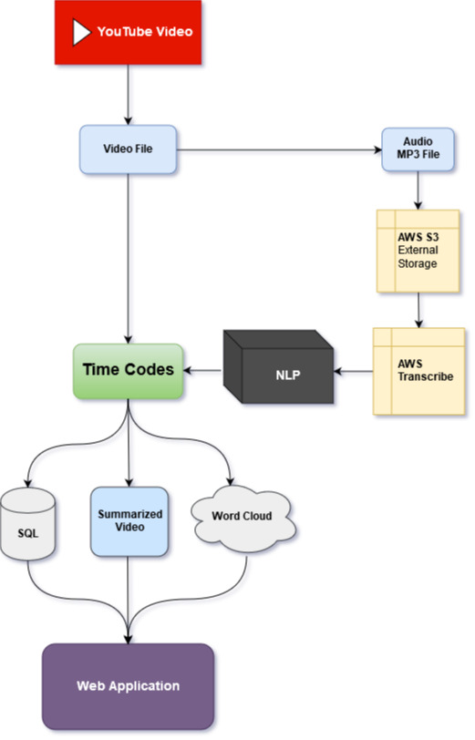
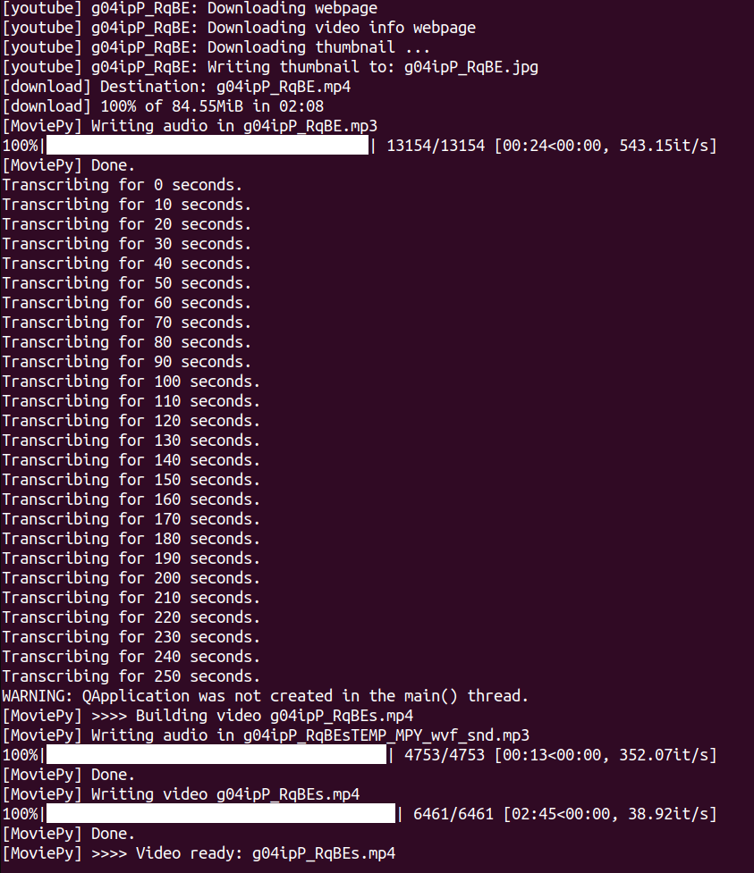
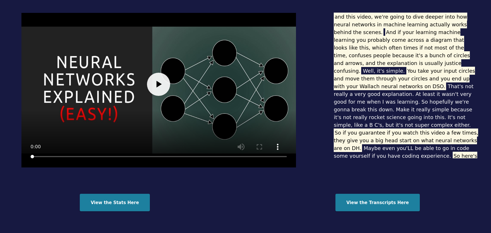
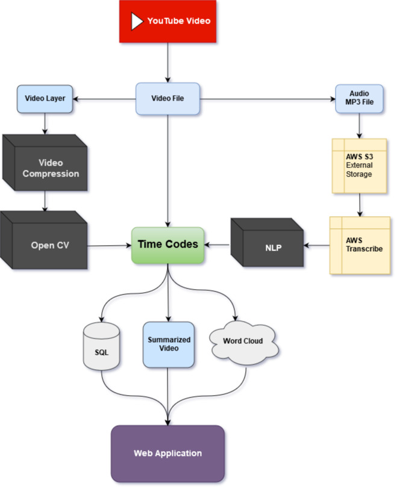

# Kiro: A Video Summarization Tool using AWS EC2, S3, Transcribe
[__Spring 2019 Galvanize Data Science Immersive__](https://www.galvanize.com/campuses/new-york)

 
A look into how one can summarize videos based on transcription data.

__Abstract:__ This project uses Youtube-dl, which downloads Youtube videos as well as their metadata and a transcription service named AWS Transcribe as tools to create this project. I used TF-IDF which is an NLP tool to discern how important certain sentences are in a video.

__Results:__ The tool works for mainly educational, documentary, and news content. Anyone can access my website [here](http://54.91.221.227:8090)   

See this work as a presentation in [Google Slides](https://docs.google.com/presentation/d/1UUxPzz1Pp2LF7FRXRhYfiQrdZgB9ZNnDXwyw4rNUSrk/edit?usp=sharing).

# Background & Motivation

One of my main motivations in creating this project was because of my love of videos. [82% of Twitter followers watch videos on Twitter.](https://www.wordstream.com/blog/ws/2017/03/08/video-marketing-statistics) More than 500 million videos are watched each day. That's a lot of content!
   
If people are watching videos daily, think about how much time can be saved by creating summarized content. In order to do this, we need to set up  pipeline where I can download the video, transcribe the audio, perform NLP, and then create a summarized version for people to watch.

## Why use AWS Transcribe instead of Youtube Captions?

In my early research on this project idea was why I didn't want to use Youtube's automated captions. One of the primary reasons is because of its accuracy. AWS Transcribe outputs a JSON file which includes the timecode and confidence interval of each word, while YT captions includes only the transcript.

What about user submitted captions? There just isn't enough user generated transcriptions for each video. From my research, 72 hours of video are generated every minute. There isn't enough people watching those videos and transcribing them. The most reliable source is an external transcription service, [AWS Transcribe](https://aws.amazon.com/transcribe/).  

## How to generate a summarized video?

One of the packages I used for this project was [MoviePy](https://zulko.github.io/moviepy/) which utilizes FFmpeg to convert and upload videos using python. This was especially exciting for me, since I was able to create subclips based on timecode and preview frames of a video. What I have realized in my research was that there are a number of packages to make this project come to life. I didn't have to reinvent the wheel.

# NLP Analysis

What I used for my project was TF-IDF. According to Wikipedia
>In information retrieval, tf–idf or TFIDF, short for term frequency–inverse document frequency, is a numerical statistic that is intended to reflect how important a word is to a document in a collection or corpus. It is often used as a weighting factor in searches of information retrieval, text mining, and user modeling. The tf–idf value increases proportionally to the number of times a word appears in the document and is offset by the number of documents in the corpus that contain the word, which helps to adjust for the fact that some words appear more frequently in general. Tf–idf is one of the most popular term-weighting schemes today; **83% of text-based recommender systems in digital libraries use tf–idf.**

TF-IDF is one of the most understandable tools in NLP. One of my main goals was to explain my project so that audience members can understand what is happening behind the scenes. Teaching people about data science can be especially hard, if they don't have any background in Math or Statistics.

With this algorithm, I will be able to gather a list of words which are the most important in the transcript. As with moviepy, I can gather some statistics about the video itself.

##### Here is an overview of the whole pipeline.
##### 1. Download the Youtube video using Youtube-dl.
##### 2. Once I have the mp4 version, I can extract its audio file to set up a job inside AWS Transcribe. Using AWS S3 as its main storage, I can use its transcription services.
##### 3. Perform my TF-IDF analysis to find the most important words in each sentence. Once I find those words, I weigh them against each sentence.
##### 4. Afterwards, I use those timecodes and sort them based on time, and create subclips for them.
##### 5. I export the video and store my statistics inside SQL and in a Wordcloud to showcase the summarized video in my web application.

      

Here are some pictures on what is happening in the background.

 

## Here is a video of the summary process.

## Further Improvements

 Since I was able to summarize videos based on audio, I plan to incorporate more NLP data analysis tools to improve on the statistics of my summary process.
   
 In addition, I will explore image compression to find useful shots for video summaries. Building a neural network to detect this would be incredibly useful. I believe OpenCV is a good way to start my process, since it can detect faces.

     
### Acknowledgements
I want to thank the number of Open Source tools out there that I was able to use in my capstone process. Natalie Hunt and Sean Reed are excellent instructors as well as my peers. MoviePy, Youtube-Dl, AWS Transcribe, EC2, S3 were huge proponents into getting this project done.

### Contact information
If there are any questions, feel free to reach me at gujh816@gmail.com
 
Here is my LinkedIn: https://www.linkedin.com/in/justin-ho-0816/  
